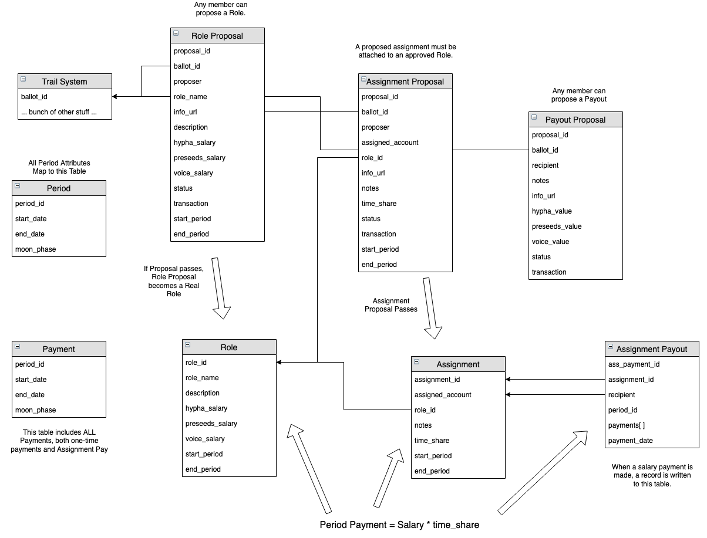

## User Registration
To register a user for Hypha DAO, the user must sign a transaction to register, and the ```hyphdaomain``` account must approve the mint action to actually issue the token.

```
cleos -u https://test.telos.kitchen push action trailservice regvoter '["johnnyhypha1", "0,HVOICE", null]' -p johnnyhypha1
cleos -u https://test.telos.kitchen push action trailservice mint '["johnnyhypha1", "1 HVOICE", "original mint"]' -p hyphadaomain
```

### Check HVOICE Balance
Check HVOICE balance using the voters table, scoped by the voter's account name.
```
cleos -u https://test.telos.kitchen get table trailservice johnnyhypha1 voters
{
  "rows": [{
      "liquid": "1 HVOICE",
      "staked": "0 HVOICE",
      "staked_time": "2019-12-10T18:05:41",
      "delegated": "0 HVOICE",
      "delegated_to": "",
      "delegation_time": "2019-12-10T18:05:41"
    }
  ],
  "more": false
}
```

## Creating a Role Proposal
To create a proposal, provide the following attributes
```
void hyphadao::proposerole (const name& proposer,               // must approve this transaction
                           const string& name,                  // any string
                           const string& content,               // any string
                           const string& description,           // any string
                           const asset& hypha_salary,           // must match asset format, "10 HYPHA"
                           const asset& preseeds_salary,        // must match asset format, "10.00000000 PRESEED"
                           const asset& voice_salary,           // must match asset format, "10 HVOICE"
                           const uint64_t& start_period,        // first period this role will be active (default to current)
                           const uint64_t& end_period);         // period at which point this role will expire (default?)
```

For example:      
```
cleos -u https://test.telos.kitchen push action hyphadaomain proposerole '["johnnyhypha1", "Underwater Basketweaver", "See my profile at: blah blah blah", "## does markdown work?", "11 HYPHA", "11.00000000 PRESEED", "11 HVOICE", 0, 104]' -p johnnyhypha1
```

## Querying a Proposal
To query a proposal based on ```id```:
```
cleos -u https://test.telos.kitchen get table --lower 26 --upper 26 hyphadaomain roles proposals
```

## Voting on a Proposal

To vote on the proposal, the user submits the action to the ```castvote``` action.
Casting a vote is the same for all proposal types (roles, assignments, and payouts).

All role, assignment, and payout proposals are either pass or fail, so simply pass a one-item array with ```"pass"``` for pass (as the example) or pass ```"fail"``` to vote against.

```
cleos -u https://test.telos.kitchen push action trailservice castvote '["haydenhypha1", "hypha1.....1b", ["pass"]]' -p haydenhypha1
```


## Viewing Vote Status

To view the voting status, you can access the ```ballots``` table:

```
➜ cleos -u https://test.telos.kitchen get table -l 1 --lower hypha1.....1b trailservice trailservice ballots
{
  "rows": [{
      "ballot_name": "hypha1.....1b",
      "category": "poll",
      "publisher": "hyphadaomain",
      "status": "voting",
      "title": "Proposal for new Role: Underwater Basketweaver",
      "description": "https://joinseeds.com",
      "content": "Weave baskets at the bottom of the sea",
      "treasury_symbol": "0,HVOICE",
      "voting_method": "1token1vote",
      "min_options": 1,
      "max_options": 1,
      "options": [{
          "key": "fail",
          "value": "0 HVOICE"
        },{
          "key": "pass",
          "value": "1 HVOICE"
        }
      ],
      "total_voters": 1,
      "total_delegates": 0,
      "total_raw_weight": "1 HVOICE",
      "cleaned_count": 0,
      "settings": [{
          "key": "lightballot",
          "value": 0
        },{
          "key": "revotable",
          "value": 1
        },{
          "key": "votestake",
          "value": 0
        },{
          "key": "writein",
          "value": 0
        }
      ],
      "begin_time": "2019-12-10T19:08:19",
      "end_time": "2019-12-10T19:09:24"
    }
  ],
  "more": true
}
```


## Close Proposal
The proposal can be closed using the ```proposal_type``` and ```id```.

```
cleos -u https://test.telos.kitchen push action hyphadaomain closeprop '["roles", 26]' -p haydenhypha1
```

## Proposing an Assignment

Now that a role is created, we can propose an assignment to that role. An assignment is an agreement between the proposer and DAO that the ```assigned account``` is executing within the defined role for the specifieid % of their time. 

In the below example, ```johnnyhypha1``` will be serving in this role for 50% for period #31 to #41. In turn, the payout is the ```time_share``` * salaries from the role specification.

```
cleos -u https://test.telos.kitchen push action hyphadaomain propassign '["johnnyhypha1", "johnnyhypha1", 0, "Assigned Basketweaver", "Underwater Basketweaver", "Weave baskets at the bottom of the sea", 31, 41, 0.5000000000]' -p johnnyhypha1
```

## Viewing an Assignment Proposal

This is the same as role proposals, except we use a ```proposal_type``` of ```assignments```.  
```
cleos -u https://test.telos.kitchen get table hyphadaomain assignments proposals
```

## Closing an Assignment Proposal

Again, same as role proposals,  except we use a ```proposal_type``` of ```assignments```.

```
cleos -u https://test.telos.kitchen push action hyphadaomain closeprop '["assignments", 0]' -p haydenhypha1
```

# Table Structure
### Coming soon

