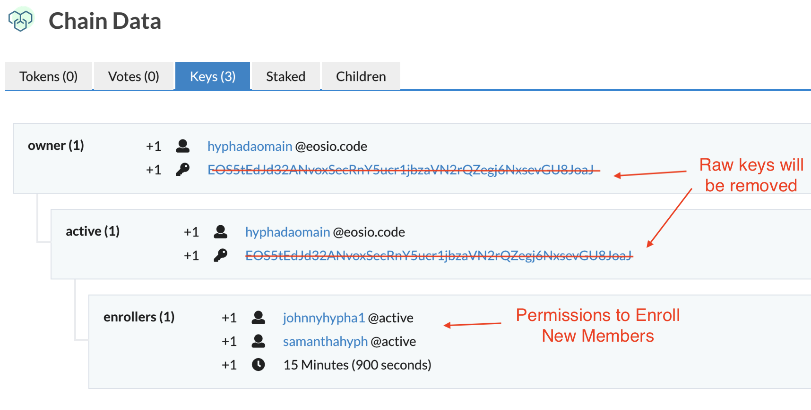

## Step 1: Register and Apply
There are two actions that require approval from the applicant, 
1. ```regvoter``` on Telos Decide, and 
1. ```apply``` on ```hyphadaomain```.

### Telos Decide ```regvoter```
To register a user for Hypha DAO, the user must sign a transaction to register.

```
cleos -u https://test.telos.kitchen push action trailservice regvoter '["hyphalondon2", "0,HVOICE", null]' -p hyphalondon2
```

Registering the voter within Telos Decide creates a record within the ```voter``` table, scoped by the account name. You can check the record by querying: 

```
cleos -u https://test.telos.kitchen get table trailservice hyphalondon2 voters
```

!!! note ""
    {
      "rows": [{
          "liquid": "0 HVOICE",
          "staked": "0 HVOICE",
          "staked_time": "2019-12-14T16:11:40",
          "delegated": "0 HVOICE",
          "delegated_to": "",
          "delegation_time": "2019-12-14T16:11:40"
        }
      ],
      "more": false
    }

> NOTE: The HVOICE balances within this table are still zero. This is because the application has not been approved yet. 

### Hypha DAO Apply
The user must also approve the action call to ```apply```. For this application, ```hyphalondon2``` is asserting that they met with Debbie at a conference, who referred the person to join.

```
cleos -u https://test.telos.kitchen push action hyphadaomain apply '["hyphalondon2", "I met with Debbie at the regen conference and we talked about Hypha. I would like to join."]' -p hyphalondon2
```

You can verify that the application was saved by querying the ```applicants``` table.
```
cleos -u https://test.telos.kitchen get table -l 1 --lower hyphalondon2 hyphadaomain hyphadaomain applicants
```

Results:
```
{
  "rows": [{
      "applicant": "hyphalondon2",
      "content": "I met with Debbie at the regen conference and we talked about Hypha. I would like to join.",
      "created_date": "2019-12-14T16:11:40.500",
      "updated_date": "2019-12-14T16:11:40.500"
    }
  ],
  "more": false
}
```

## Step 2: Enroll and Mint HVOICE
The Enrollers are assigned to review applications and enroll new accounts. Enrollers are added to a special EOSIO permission on the ```hyphadaomain``` account named ```enrollers```.



*Above: enrollers permission is a child permission of active*

[Click to here to view on bloks.io](https://telos-test.bloks.io/account/hyphadaomain#keys)

### ```enroll``` action
Once the application is reviewed, an enroller can submit the ```enroll``` action and include a note with the enrollment. The string provided as the last parameter to ```enroll``` is not persisted within the smart contract. It is only written to the action traces in order to record any notes associated with the approval. 

The transaction is signed by ```johnnyhypha1```, but it could also be approved by ```samanthahyph``` because that account is listed under the ```hyphadaomain@enrollers``` permission.

```
cleos -u https://test.telos.kitchen push action hyphadaomain enroll '["johnnyhypha1", "hyphalondon2", "Debbie confirmed she made this referral"]' -p johnnyhypha1
```

When the enroll action is executed, three behaviors occur: 
1. ```1 HVOICE``` is minted to the approved applicant, making them eligible to vote
2. The approved applicant is added to the ```members``` table
3. The application is erased from the ```applications``` table

### Check HVOICE Balance in the ```voters``` table
Check HVOICE balance using the ```voters``` table, scoped by the voter's account name.
The new user has 1 HVOICE.
```
cleos -u https://test.telos.kitchen get table trailservice hyphalondon2 voters
```

Results:
```
{
  "rows": [{
      "liquid": "1 HVOICE",
      "staked": "0 HVOICE",
      "staked_time": "2019-12-10T18:05:41",
      "delegated": "0 HVOICE",
      "delegated_to": "",
      "delegation_time": "2019-12-10T18:05:41"
    }
  ],
  "more": false
}
```

### Check the ```applicants``` table
The application is erased. 
```
cleos -u https://test.telos.kitchen get table -l 1 --lower hyphalondon2 --upper hyphalondon2 hyphadaomain hyphadaomain applicants
```
Results:
```
{
  "rows": [],
  "more": false
}
```

### Check the ```members``` table
The member is added.
```
cleos -u https://test.telos.kitchen get table -l 1 --lower hyphalondon2 --upper hyphalondon2 hyphadaomain hyphadaomain members
```
Results:
```
{
  "rows": [{
      "member": "hyphalondon2"
    }
  ],
  "more": false
}
```

## Full Life Cycle
Here are the cleos commands for the full lifecycle.

```
# You can run these statements over and over because the commands end with the same state as the beginning
# The applicant must run these two actions (preferably as the same transaction)
cleos -u https://test.telos.kitchen push action trailservice regvoter '["hyphalondon2", "0,HVOICE", null]' -p hyphalondon2
cleos -u https://test.telos.kitchen push action hyphadaomain apply '["hyphalondon2", "I met with Debbie at the regen conference and we talked about Hypha. I would like to join."]' -p hyphalondon2

# NOTE: johnnyhypha1@active is part of the hyphadaomain@enrollers permission, so he can approve an enrollment
cleos -u https://test.telos.kitchen push action hyphadaomain enroll '["johnnyhypha1", "hyphalondon2", "Debbie confirmed she made this referral"]' -p johnnyhypha1

# The account can be unregistered if they transfer away their HVOICE and call unregvoter
cleos -u https://test.telos.kitchen push action trailservice transfer '["hyphalondon2", "johnnyhypha1", "1 HVOICE", "memo"]' -p hyphalondon2
cleos -u https://test.telos.kitchen push action trailservice unregvoter '["hyphalondon2", "0,HVOICE"]' -p hyphalondon2

# And then hyphadaomain can remove the account from the member list
cleos -u https://test.telos.kitchen push action hyphadaomain removemember '["hyphalondon2"]' -p hyphadaomain  
```